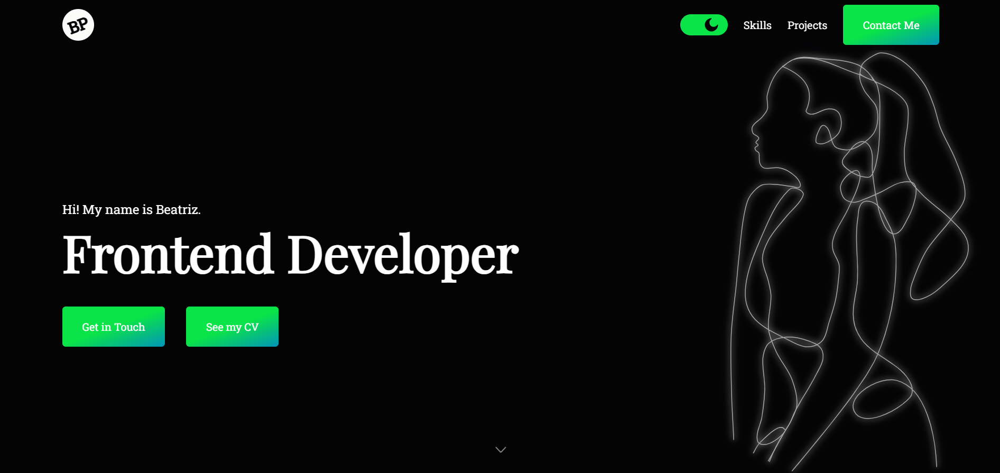
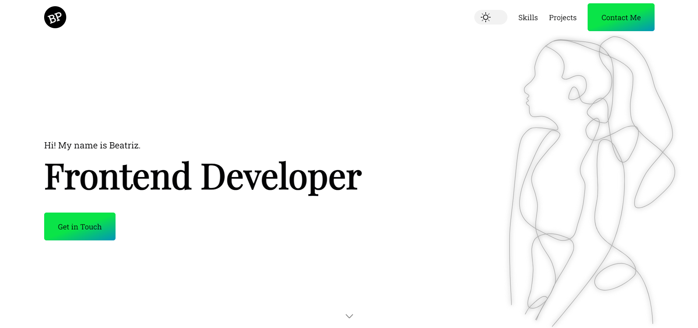

# Beatriz's Portfolio - Frontend Developer

Welcome to my portfolio! Here you will find information about me and a list of projects I create as a Frontend Developer.

## Learning

I created this project to show my work developed throughout this year, but also to improve other skills, for example:

- Make each component have its own responsibility;
- Improve the design system and use dark mode for the first time;
- Improve mobile phone responsive.

## Technologies

In this portfolio, I used several technologies, including:

- HTML
- CSS
- JavaScript
- React.js
- Typescript
- Inkscape

## Purpose

- This portfolio is more than just a collection of projects.
- It is the result of my journey throughout this year, a testimony of my learning, improvement and passion for development.
- Each project I present here is not just a code, but a learning path, where each line written represents a discovery and implementation of new technologies and approaches. 🥰

Hope you enjoying it! 🙃

## Contact

Feel free to contact me! You can find me at:

- Email: [bp111199@gmail.com](mailto:bp111199@gmail.com)

## Building a new deployment

1. Do commit: `git add .` then `git commit -m " Message that I wanna see about what I do in this commit"`;
2. Build with `yarn build` and wait until folder build is created;
3. Delete folder `docs`;
4. Rename folder `build` to folder `docs`
5. Do push with command `git push`
